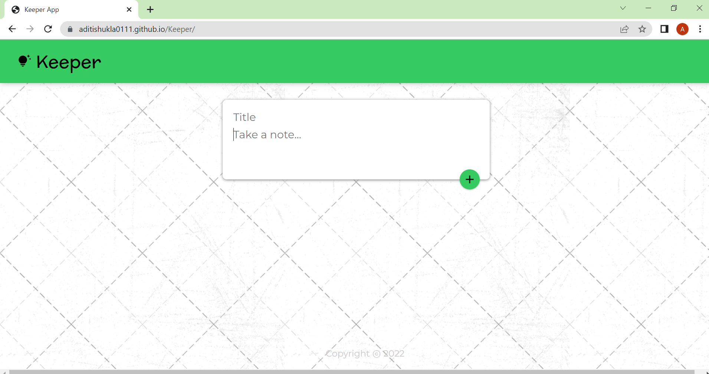

<h1>Keeper</h1>

It is a web application that will help users to make short notes.

<h1>Technologies Used</h1>
<ul>
  
  
  
  
</ul>
<h1>This is how the project look like 👇</h1>
<h4>Landing Page</h4>

<h4>Adding a note 👇</h4>

<h4>Deleting a note👇</h4>

<h4>Deleting a note👇</h4>

<h1>The Project is hosted <a href="https://aditishukla0111.github.io/Keeper/">here</a></h1>
  
